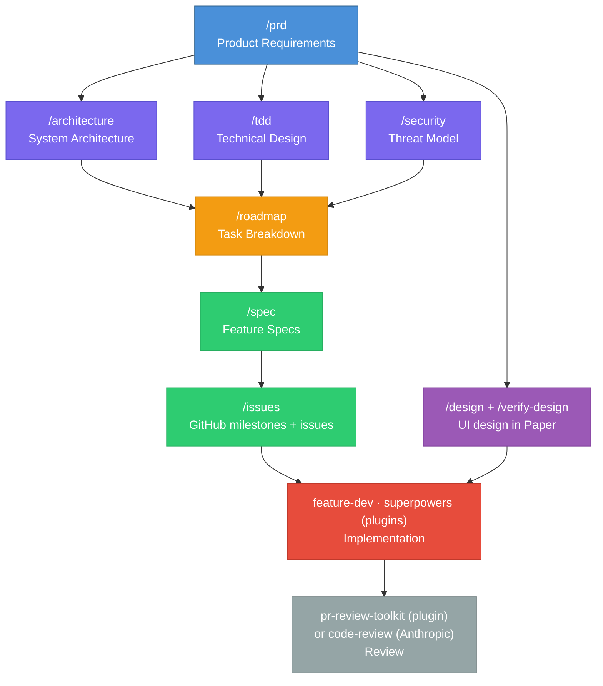
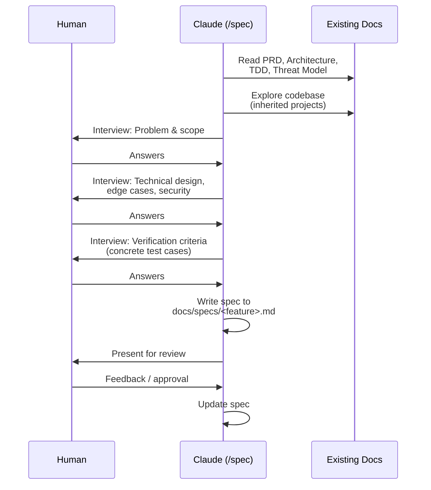
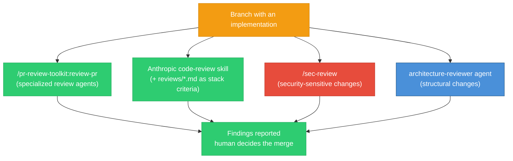
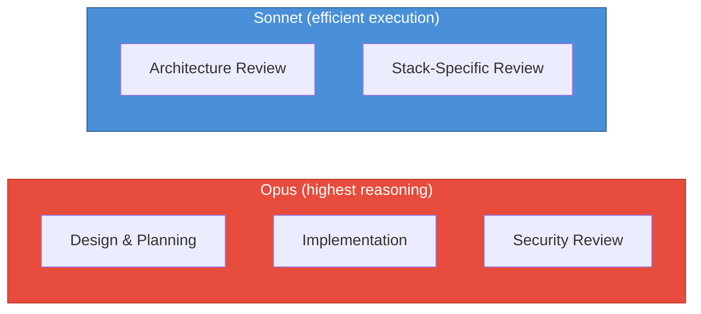
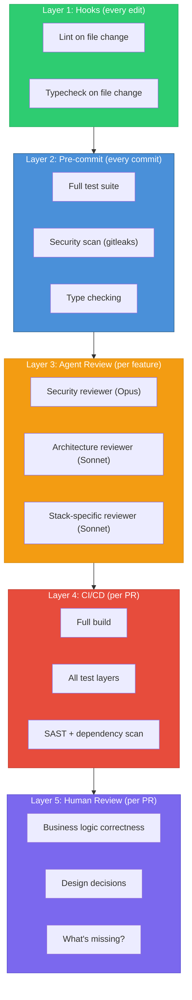

# Spec-Driven Development

> A methodology where specifications are the source of truth for all implementation, testing, and review. AI agents execute specs — not vague instructions.

---

## What is Spec-Driven Development?

Spec-Driven Development (SDD) is a workflow where every feature, fix, and architectural decision is defined in a specification **before** any code is written. The spec is the contract between the human (who decides *what* to build) and the AI agent (who decides *how* to build it).

The core insight: AI is a powerful executor but a poor decision-maker. When you give it a vague instruction like "add authentication", you get code that "looks right" but misses edge cases, security requirements, and integration constraints. When you give it a precise spec with verification criteria, you get code that's correct on the first pass.

**SDD is not waterfall.** Specs are living documents — they get refined through interviews, updated as constraints emerge, and versioned alongside the code. The key difference from ad-hoc prompting is that the spec exists as an artifact that can be reviewed, shared, and referenced by multiple agents.

---

## The Document Hierarchy

Specs don't exist in isolation. They form a layered system where each document builds on the ones above it:



| Layer | Document | Purpose | Created by |
|-------|----------|---------|------------|
| **Why** | PRD | What we're building and why | `/prd` |
| **How (system)** | Architecture | System structure, components, data flow | `/architecture` |
| **How (process)** | TDD | Technical Design — testing, dev env, CI/CD, coding standards | `/tdd` |
| **How (security)** | Threat Model | Trust boundaries, attack surface, defenses | `/security` |
| **When** | Roadmap | Phased tasks from design docs, with dependencies and parallelism | `/roadmap` |
| **What (feature)** | Feature Spec | Detailed implementation spec per task in the roadmap | `/spec` |
| **Hand-off** | GitHub issue | One issue per task/slice, carrying its spec path — ready to be implemented | `/issues` |

The roadmap is generated from the design docs (PRD, architecture, TDD, threat model) — it breaks the project into phased tasks before detailed specs exist. Then each task gets a detailed feature spec (`/spec`) that references the architecture, technical design, and threat model. This means implementation agents have full context without needing everything repeated. Finally `/issues` files each task as a GitHub issue that links its spec — the planning chain ends there, with an issue ready to be implemented. Implementation and review are handled by marketplace plugins, not by this toolkit's skills.

---

## The Interview Pattern

Every spec is created through a structured interview, not a one-shot prompt. The interview pattern ensures completeness:



The interview goes deep on the hard parts: edge cases, failure modes, security boundaries, and concrete verification criteria with inputs and expected outputs. The human decides *what*; Claude asks the questions that ensure nothing is missed.

---

## From Spec to Code: The Implementation Pipeline

Once an issue and its spec exist, implementation is handed to Claude Code plugins from the `claude-plugins-official` marketplace (`feature-dev`, `superpowers`, `pr-review-toolkit` — see the README's "Required plugins"). This is where the cost of spec-writing pays off — every downstream step has clear inputs.

### Single Feature Flow


For one issue, the `feature-dev` plugin drives the read → plan → implement → review part of this as a guided, interactive workflow. It is not spec-file driven by itself, so give it the issue and its spec path:

```
/feature-dev:feature-dev implement issue #42 per docs/specs/003_auth.md
```

It explores the codebase, asks clarifying questions, proposes approaches, implements after your approval, and runs its own quality review. Run a fresh reviewer on the diff (`/pr-review-toolkit:review-pr`, which reads uncommitted changes), then commit (`/commit`), push and open the PR (`gh pr create`). For a bug, the `superpowers` plugin's `systematic-debugging` skill replaces the spec step with a root-cause investigation.

### Executing Several Tasks

This toolkit no longer has a one-command pipeline that runs a whole roadmap or milestone and merges it. For several tasks, the `superpowers` plugin provides the building blocks:

- **`subagent-driven-development`** — a fresh implementer subagent per task, a review (spec compliance + code quality) after each, and a whole-branch review at the end.
- **`executing-plans`** — the same plan executed inline in one session, with one fresh-context review at the end.
- **`dispatching-parallel-agents`** — one agent per independent problem, run concurrently.

Each task still maps to one issue, one short-lived branch and one PR, and merging stays a human decision unless you say otherwise for that piece of work.

---

## The Review Layer

Every implementation goes through a review by a fresh reviewer before merge — never the session that wrote the code. In Claude Code, `/pr-review-toolkit:review-pr` runs specialized review agents over the diff (general code review, test coverage, silent failures, comments, type design, simplification) and aggregates the findings as critical / important / suggestions. For stack-aware review, use Anthropic's official `code-review` skill and hand it the matching language guide from `reviews/` (`go.md`, `rust.md`, `typescript.md`, `python.md`) as stack criteria. Security-sensitive changes also get `/sec-review`; the `architecture-reviewer` agent is available for structural changes.



> The previous in-repo `/code-review` skill fanned out to three nested subagents (security, architecture, stack) loading `reviews/` guides as sectioned prompts. It was deprecated after a benchmark (`code-review-workspace/iteration-1/`) showed no detection lift over a no-skill baseline at ~1.5× the cost, and its nested subagents didn't execute in parallel as designed.

---

## Model Strategy: Quality Where It Matters

Not every task requires the same level of reasoning. The workflow uses a tiered model strategy to optimize cost without sacrificing quality where it matters most:



| Task Type | Model | Why |
|-----------|-------|-----|
| Spec writing, interviews, design | **Opus** | Creative reasoning, catching edge cases |
| Implementation (main session) | **Opus** | Complex design decisions |
| Security review | **Opus** | False negatives are catastrophic |
| Architecture review | **Sonnet** | Structured criteria, checklist-driven |
| Stack-specific review | **Sonnet** | Matching against loaded review guides |

The principle: **Opus for decisions, Sonnet for execution.** Security is the exception — even though it follows structured criteria, the cost of missing a vulnerability far outweighs the savings from a cheaper model.

---

## Quality Gates: Defense in Depth

SDD doesn't rely on any single gate. Quality is enforced at every layer:



---

## When to Use What

Not every project needs every step. Here's a decision guide:

| Scenario | What to use |
|----------|-------------|
| Quick fix or small feature on existing project | `/spec` + `/issues`, then `/feature-dev:feature-dev` |
| New feature touching multiple components | `/spec` + `/issues`, then `/feature-dev:feature-dev` |
| Greenfield project | `/new-project` + `/prd` + `/architecture` + `/tdd` + `/security` + `/roadmap` + `/spec` + `/issues`, then `/feature-dev:feature-dev` per issue |
| Full roadmap with many features | All of the above; work through the issues with `superpowers`' `subagent-driven-development` or `executing-plans` (no one-command roadmap pipeline) |
| Architectural decision | `/adr` |
| Significant change needing team input | `/rfc` |
| Bug fix | `superpowers`' `systematic-debugging` skill (root cause first, no spec needed) |
| Security audit | `/sec-review` (standalone, 4 parallel agents on Opus) |
| Code review | `/pr-review-toolkit:review-pr` (multi-agent PR review) or Anthropic's `code-review` skill (stack-aware) |

---

## Key Principles

1. **Specs are contracts, not documentation.** They define what "done" means. Verification criteria are concrete test cases with inputs and expected outputs — not vague acceptance criteria.

2. **The human decides what; the AI decides how.** Specs capture decisions. Implementation agents have freedom in *how* they build, but not in *what* they build.

3. **Context flows down, never up.** Higher-level documents (PRD, architecture) inform lower-level ones (specs, roadmap). Implementation agents read the spec and its references — they don't need the full conversation history.

4. **Review is separate from writing.** The writer/reviewer pattern uses fresh sessions to avoid confirmation bias. The agent that wrote the code never reviews it.

5. **Security is non-negotiable.** Security review always runs on the highest-quality model. The cost of a missed vulnerability dwarfs any model cost savings.

6. **Parallel by default.** Worktrees, background agents, and phased roadmaps allow multiple streams of work without conflicts. The orchestrator stays thin — it tracks progress, not code.
